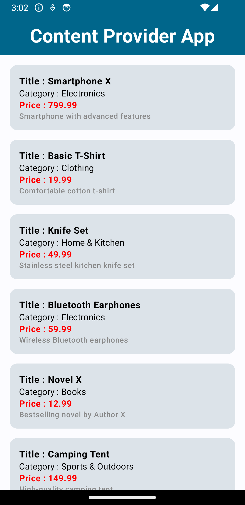
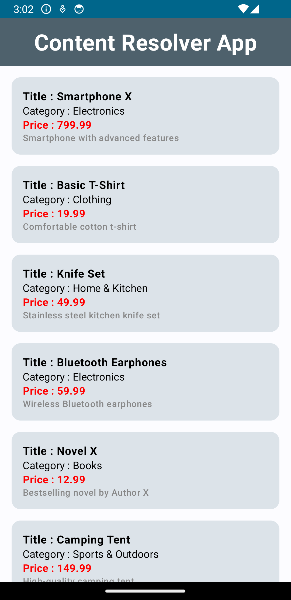

# Custom_Content_Provider

## Description

Custom_Content_Provider is an Android application focusing on Android Content Providers. This project serves as a comprehensive guide on implementing and utilizing custom content providers effectively in modern Android development.

### Technologies Used:

- **Kotlin**
- **Jetpack Compose**
- **Hilt Dependency Injection**
- **Clean Code Architecture**

Custom_Content_Provider showcases best practices in Android development by leveraging these technologies.

## Screenshots

### Content Provider App Screenshot

### Content Resolver App Screenshot

## Table of Contents

- [Installation](#installation)
- [Usage](#usage)
- [Contributing](#contributing)
- [License](#license)

## Installation

1. Clone the repository:
git clone https://github.com/rahulgothwal5/Custom_Content_Provider.git

2. Open the project in Android Studio.

## Usage

Explore the codebase to learn how to implement custom content providers and content resolvers effectively in your Kotlin Android app. Make use of **Jetpack Compose** for UI, **Kotlin** for coding, **Hilt Dependency Injection** for managing dependencies, and ensure adherence to **Clean Code Architecture** principles.

## Contributing

1. Fork the repository.
2. Create a new branch (`git checkout -b feature/your-feature-name`).
3. Make your changes.
4. Commit your changes (`git commit -am 'Add new feature'`).
5. Push to the branch (`git push origin feature/your-feature-name`).
6. Create a new Pull Request.

## License

This project is licensed under the [MIT License](LICENSE).
